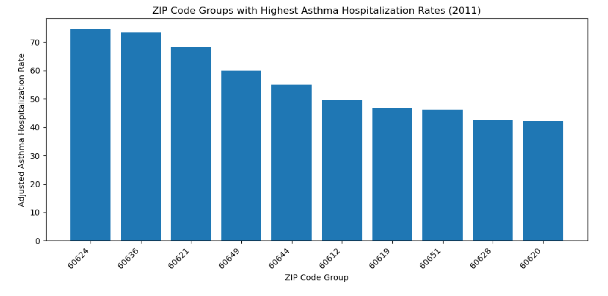
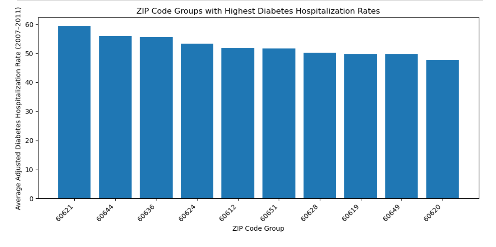
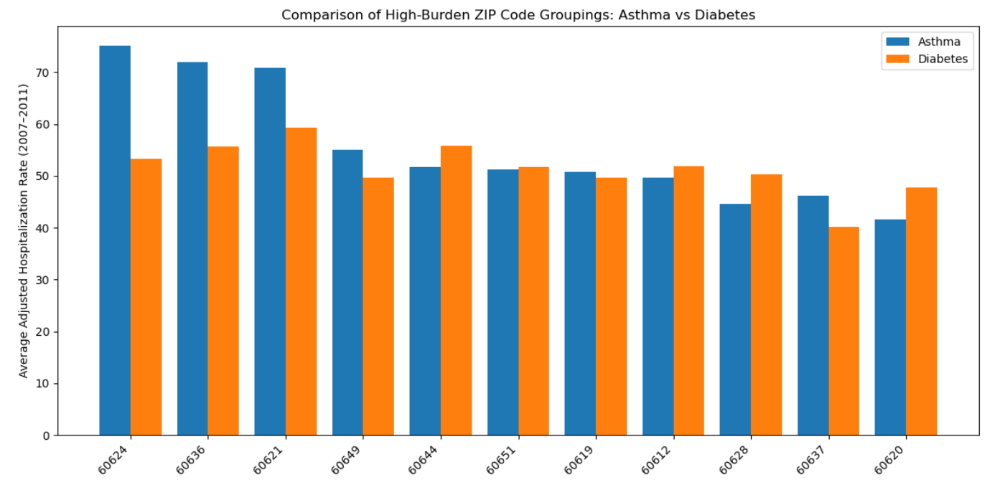
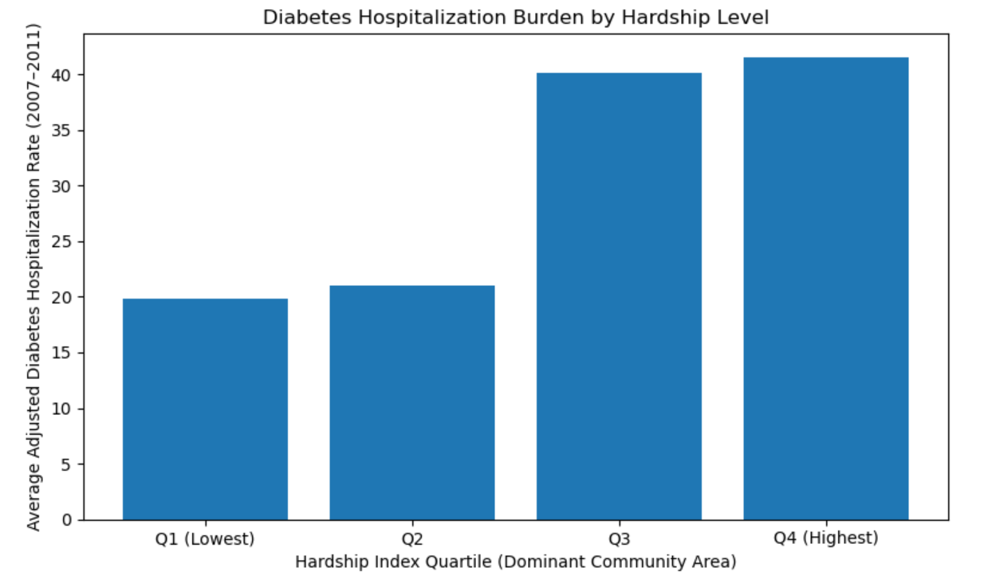

# Chicago Health Disparities: Asthma, Diabetes, and Socioeconomic Context

This project examines geographic disparities in chronic disease hospitalization rates
across Chicago, focusing on asthma and diabetes. Using ZIP code–level hospitalization
data and the Chicago Hardship Index, the analysis explores where disease burden is
concentrated and how it aligns with broader socioeconomic conditions.

The project is organized as a sequence of analyses, beginning with disease-specific
patterns, followed by cross-condition comparison, and concluding with socioeconomic
context.

---

## Data Sources

- **Asthma Hospitalizations:** Chicago asthma hospitalization rates by ZIP code grouping
- **Diabetes Hospitalizations:** Chicago diabetes hospitalization rates by ZIP code grouping
- **Hardship Index:** Chicago community-area-level socioeconomic hardship index
- **Geographic Crosswalk:** Population-weighted ZIP code to community area equivalency
  (2010 Census population overlap)

All analyses are descriptive and based on publicly available data.

---

## Asthma Hospitalization Patterns

Asthma hospitalization rates were summarized using five-year average adjusted rates
(2007–2011) to reduce year-to-year variability. Substantial geographic variation is
observed, with a subset of ZIP code groupings experiencing persistently elevated asthma
hospitalization burden.

---

## Diabetes Hospitalization Patterns

A parallel analysis was conducted for diabetes hospitalizations using the same
five-year window and methodology. As with asthma, diabetes hospitalization burden
is unevenly distributed across ZIP code groupings.

---

## Cross-Condition Comparison: Asthma vs Diabetes

Asthma and diabetes hospitalization results were compared to identify ZIP code
groupings with elevated burden for one or both conditions. Some ZIP code groupings
appear among the highest-burden areas for both diseases, while others exhibit
condition-specific patterns, suggesting that geographic disparities are partially
shared but not identical across chronic conditions.

---

## Socioeconomic Context: Hardship Index

To provide socioeconomic context, ZIP code groupings were linked to Chicago community
areas using a population-weighted ZIP–community area crosswalk. Each ZIP code was
assigned to a dominant community area based on 2010 Census population overlap. The
Chicago Hardship Index was then associated with ZIP-based hospitalization results for
descriptive comparison.

When ZIP code groupings are grouped into hardship index quartiles, average hospitalization
rates differ across hardship levels for both asthma and diabetes.

### Asthma Hospitalization Burden by Hardship Level

### Diabetes Hospitalization Burden by Hardship Level

ZIP code groupings associated with higher-hardship community areas generally exhibit
higher average hospitalization burden than those associated with lower-hardship areas.
These patterns are consistent with broader public health literature describing the
geographic concentration of chronic disease burden in socioeconomically disadvantaged
areas.

---

## Key Takeaways

- Asthma and diabetes hospitalization burden is geographically uneven across Chicago.
- Certain ZIP code groupings experience persistently high hospitalization rates for
  one or both chronic conditions.
- High-burden areas frequently align with higher socioeconomic hardship.
- Observed patterns are descriptive and provide context rather than evidence of causation.

---

## Methodological Notes

- ZIP codes and Chicago community areas do not align perfectly.
- Hardship index values were linked to ZIP code groupings using a dominant-community-area
  approximation based on population overlap.
- This project does not perform causal inference or predictive modeling.

---

## Tools Used

- **Programming & Analysis:** Python (pandas, matplotlib)
- **Environment:** Jupyter Notebook
- **Data Handling:** CSV and Excel
- **Version Control:** GitHub
