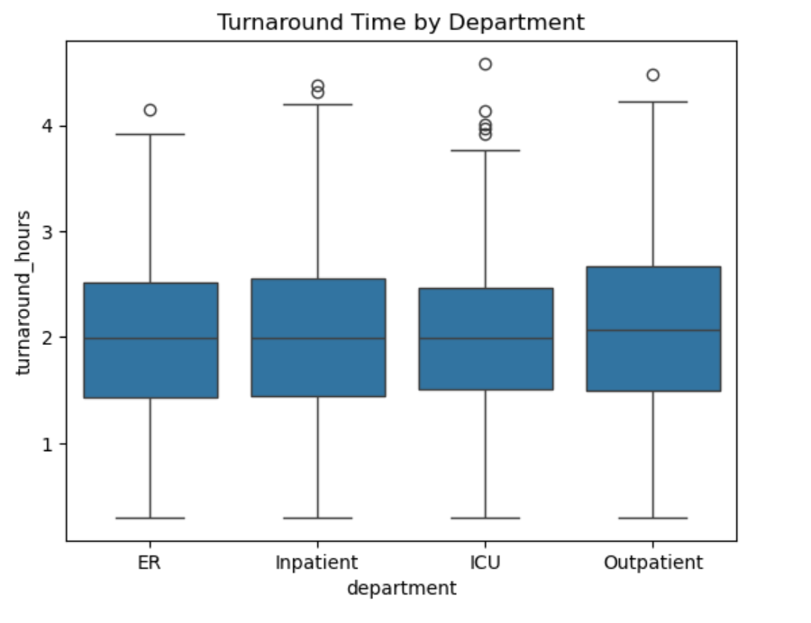
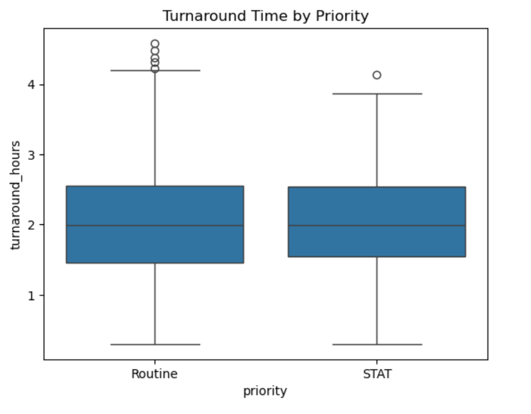

## Hospital Lab Turnaround Time Analysis

This project explores patterns in turnaround times for hospital lab tests  using a synthetic intermediate dataset. The goal is to identify differences in turnaround time by test type, department, priority, and result flag.

This project explores patterns in turnaround times for hospital lab tests  using a synthetic intermediate dataset. The goal is to identify differences in turnaround time by test type, department, priority, and result flag.
---

## Objectives
- Calculate average and median turnaround times by test type.
- Visualize daily TAT trends and highlight outliers.
- Suggest operational improvements based on findings.

---

## Dataset
- **Source:** Simulated hospital lab data (1,000 samples)
- **Columns:** `test_type`, `received_time`, `completed_time`, `technician_id`, `result_flag`, `department`, and `priority`

---

## Methods
1. Parsed timestamps and calculated duration (`completed - received`).
2. Grouped by test type, department, priority, and result flag and visualized turnaround times.
---

## Results
- Mean TAT (hours) by test type
  - Microbiology    1.946775
  - Immunology      1.969776
  - Hematology      2.030214
  - Chemistry       2.043625

- Mean TAT by department
  - ER            1.970629
  - ICU           1.973085
  - Inpatient     1.982991
  - Outpatient    2.068906

- Mean TAT by priority:
  - Routine    2.003306
  - STAT       1.984185

- Mean TAT by result flag:
  - Abnormal    1.970255
  - Normal      2.004834
---

## Visuals

---

## Tools Used
- Python (pandas, matplotlib)
- Jupyter Notebook
- Excel (data validation)
